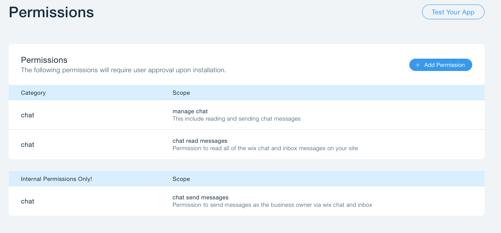
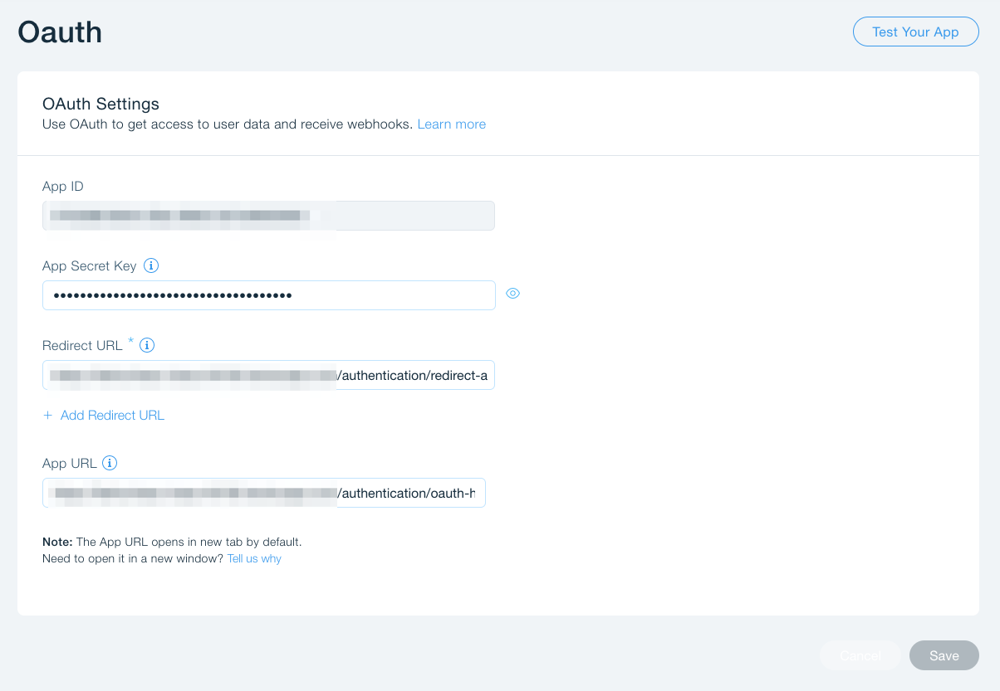
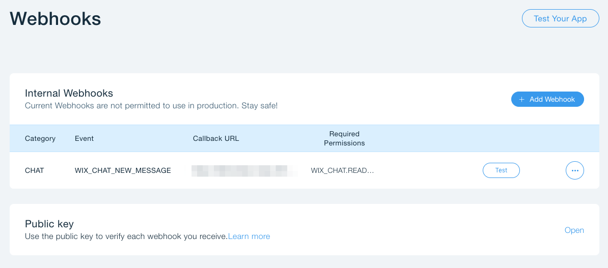

### How to run locally?

* `npm install`
* Run `ngrok http 3000` to tunnel a real url to your localhost
* Add a `.env` file in the project root that has the following structure:
```$xslt
app_secret=<secret>
APP_ID=<app_id>
BASE_URL=<your ngrok url> for example: https://7fe51b63.ngrok.io
PORT=3000
DB_URL=a simple key value store end point
PUBLIC_KEY="the public key from the dev center, see format below"
```

an example for `PUBLIC_KEY` entry:
`PUBLIC_KEY="-----BEGIN PUBLIC KEY-----\nMIIBIjANBgkqhpitO4nQIL8mZ1q\nb1kT0YJ...\n-----END PUBLIC KEY-----"

* `npm run start:dev`


### How to configure your app in the wix dev center

#### Permissions

* Make sure that you have all of the following permissions




#### OAuth

* Set your oauth settings as follows




#### Webhooks

* Set the `WIX_CHAT_NEW_MESSAGE` webhook




